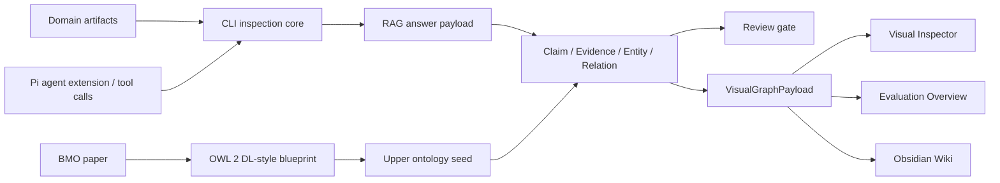
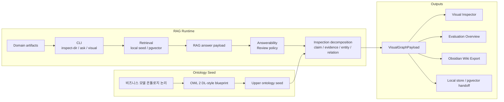
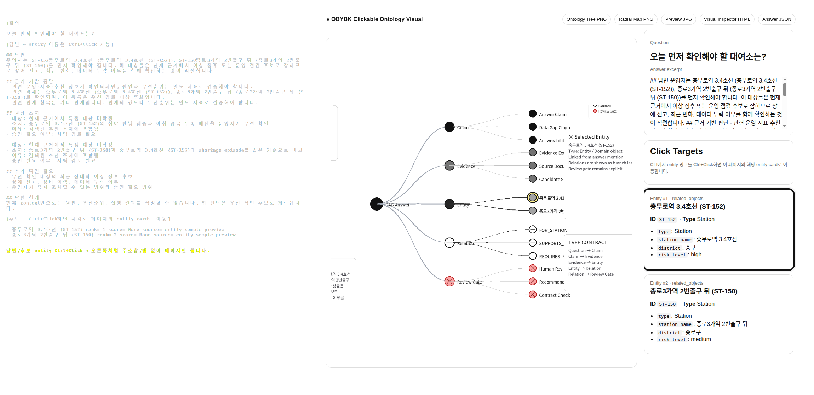
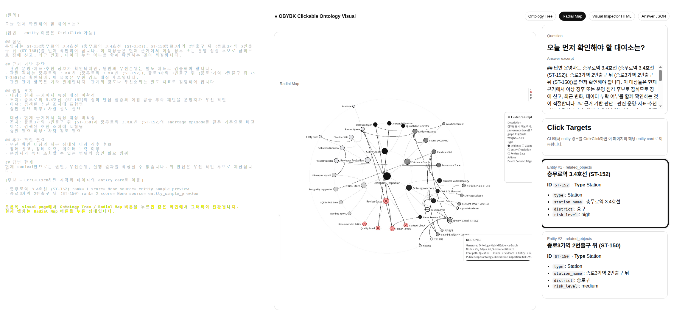
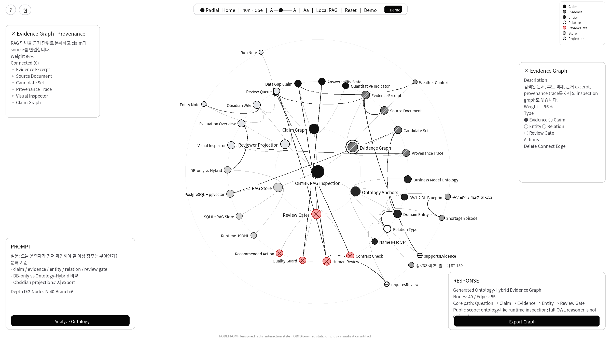
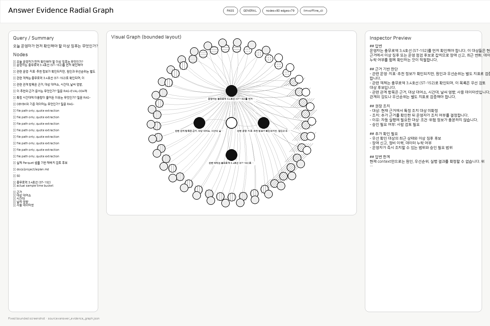
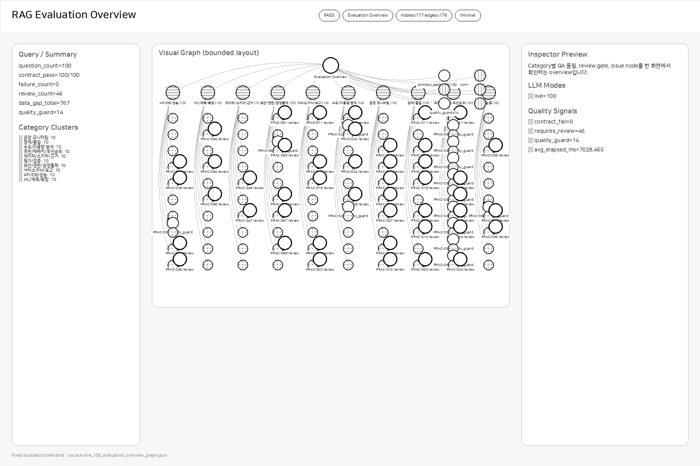
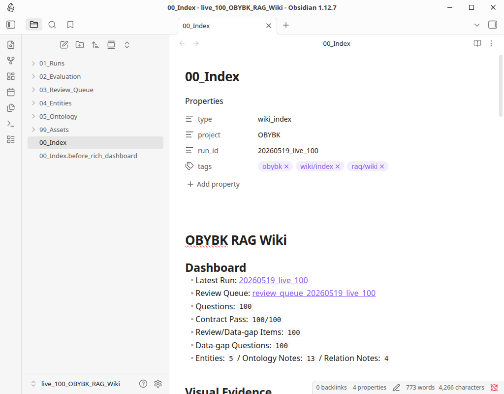
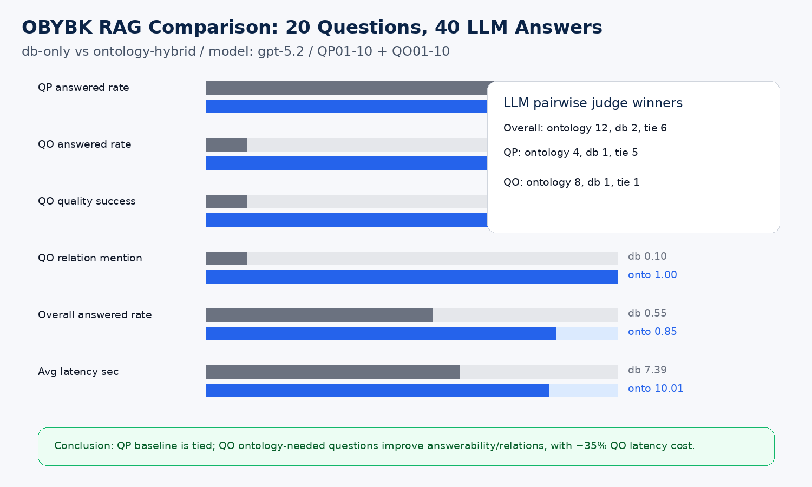
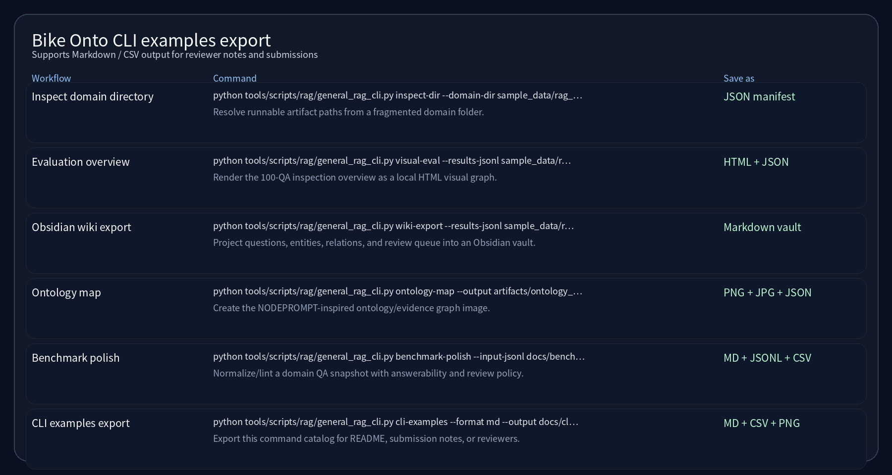

# Bike Onto

**OBYBK — 비즈니스 모델 온톨로지 논리를 기반으로 한 CLI-first RAG 답변 검토 프레임워크**

<p align="center">
  
  
  
  
  
  
</p>

> **RAG finds evidence. OBYBK makes the answer inspectable.**

OBYBK는 비즈니스 모델 온톨로지 논리를 기반으로 RAG 답변을 **claim, evidence, entity, relation, review gate**로 나누어 사람이 검토할 수 있는 산출물로 남기는 CLI-first framework입니다. CLI는 안정적인 백엔드로 유지하고, Pi agent extension은 이 검토 흐름을 기존 agent harness 안에서 도구처럼 호출할 수 있게 해주는 인터페이스입니다.

서울 공공 모빌리티 데이터는 이 프레임워크를 검증하기 위한 **case-study binding**입니다. 이 프로젝트의 중심은 특정 서비스 분석기가 아닙니다. 핵심은 어떤 도메인 데이터든 RAG 답변을 검증 가능한 evidence graph로 바꾸는 방법입니다.

> **Scope**: 이 repo는 production service가 아니라 포트폴리오용 구현입니다. 목표는 “운영 시스템 완성”이 아니라, RAG 답변을 inspection artifact로 바꾸는 설계와 CLI 흐름을 보여주는 것입니다.



---

## What I Built

OBYBK는 다음 문제를 해결합니다.

```text
질문 → Pi agent/CLI 호출 → 검색/RAG 답변 → 근거 구조화 → 시각 검토 → 평가 요약 → 위키/DB 저장
```

핵심 구현:

- `inspect-dir`: 흩어진 도메인 산출물 폴더를 검사하고 실행할 파일을 찾아 고정
- 인자 없는 `./bike`: 첫 setup 후 바로 채팅 모드로 진입
- Pi agent extension: `/bike-setup`, `/bike-status`, `/bike-tools`와 LLM이 호출할 수 있는 RAG inspection tools 등록
- `ask/chat`: local seed 또는 PostgreSQL/pgvector 기반 RAG 답변 생성
- `visual`: 단일 답변을 claim/evidence/entity/relation/review graph로 시각화
- `visual-eval`: 100문항 평가 결과를 overview graph로 요약
- `wiki-export`: 평가 결과를 Obsidian ontology-like wiki로 내보내기
- `benchmark-polish`: QA benchmark를 사용자 문체와 answerability/review policy에 맞게 정리
- `ontology-map`: NODEPROMPT-inspired radial/tree ontology visual 생성
- `pgvector-*`: live PostgreSQL/pgvector 검색 어댑터
- `snippet-*`: agent/prompt 재사용을 위한 local snippet store

---

## Implementation Status

이 README는 구현된 부분과 아직 production-ready로 주장하지 않는 부분을 나누어 적습니다.

| Area | Status |
|---|---|
| CLI workflow | 구현됨: 첫 `setup`, 인자 없는 `./bike` chat, `inspect-dir`, `ask`, `chat`, `visual`, `visual-eval`, `wiki-export`, `ontology-map` |
| Pi agent extension | 구현됨: project-local `.pi/extensions/bike-onto`, `/bike-*` commands, LLM이 호출할 수 있는 inspection tools |
| RAG inspection payload | 구현됨: claim, evidence, entity, relation, review gate 분해 |
| Ontology seed anchor | BMO 기반 blueprint와 재사용 가능한 upper ontology seed generator 문서화/구현 |
| Visual workflow | 구현됨: clickable CLI links, ontology tree/radial page, app-window mode |
| Evaluation | reference snapshot: domain-specific benchmark policy + Seoul Bike 100 QA case-study snapshot |
| Obsidian projection | 구현됨: run/question/entity/relation/review notes와 backlinks |
| Retrieval store | local adapter: SQLite handoff + PostgreSQL/pgvector adapter |
| Tests | packaged fixtures와 smoke/regression tests 기준 `187 passed, 3 warnings` |
| Not claimed | production deployment, managed service, complete domain DB reproduction, full OWL reasoner runtime, complete OWL validation pipeline, independent human evaluation |

---

## Why It Matters

일반 RAG 답변은 그럴듯해 보여도 실제 의사결정에서는 다음 질문이 남습니다.

| 질문 | OBYBK의 처리 |
|---|---|
| 어떤 주장이 생성됐는가? | Claim node |
| 어떤 근거가 받치는가? | Evidence node / source path / excerpt |
| 어떤 개체가 답변에 등장하는가? | Entity card / normalized display name |
| 어떤 관계를 거쳐 판단했는가? | Relation edge / provenance hint |
| 자동 수용 가능한가? | Review gate / answerability policy |
| 사람이 봐야 하는 이유는 무엇인가? | review_reason / data gap / confidence signal |

OBYBK는 RAG를 “답변 생성기”가 아니라 **검증 가능한 지식 산출 흐름**으로 다룹니다.

---

## Core Concepts

| Unit | Meaning |
|---|---|
| Claim | 답변이 주장하는 핵심 문장 |
| Evidence | claim을 뒷받침하는 파일, row, 문서, graph object |
| Entity | 답변에 등장하는 사람, 장소, 조직, 자산, 지표, 이벤트 |
| Relation | entity/evidence/metric/action 사이의 의미 관계 |
| Review Gate | 자동 수용 가능 여부, 사람 검토 사유, data gap |
| Answerability | 실행 가능성 또는 제한 사유의 분류 |
| Natural Label | `gender=1.0` 같은 내부 코드를 `남성(M)`처럼 사용자가 읽기 쉬운 label로 변환 |

---

## Scope Note: Ontology-Hybrid

OBYBK의 ontology 설계는 Alexander Osterwalder의 **비즈니스 모델 온톨로지(Business Model Ontology)**를 OWL 2 DL 스타일로 정리한 내부 청사진을 기반으로 합니다.

```text
docs/project/business_model_ontology_owl2dl_formalization_blueprint.md
```

현재 구현 범위:

- OWL 2 DL-style formalization blueprint 문서화
- ontology-like inspection layer runtime
- entity normalization / natural-language display label
- relation label normalization
- evidence link / provenance hint / confidence signal
- review gate / data gap marker
- Obsidian tag/backlink projection
- VisualGraphPayload 기반 graph rendering

현재 범위 밖:

- full OWL reasoner runtime
- complete OWL validation pipeline
- OWL axiom 기반 자동 논리 추론 engine

즉, OBYBK의 ontology는 완전한 논리 추론 엔진이 아니라 **RAG 답변을 검토 가능하게 만드는 의미 구조화 계층**입니다.

---

## Ontology Seed 기준: 비즈니스 모델 온톨로지 논리

OBYBK의 ontology seed는 임의의 태그 묶음이 아닙니다. Alexander Osterwalder의 **비즈니스 모델 온톨로지(Business Model Ontology)** 논리를 기반으로 구현했습니다.

OBYBK의 큰 축은 LLM이 즉흥적으로 만든 분류가 아니라, 논문 기반 개념 모델에서 출발합니다. LLM은 표현 정리와 후보 확장을 돕지만, 최상위 ontology axis는 비즈니스 모델 온톨로지 논리와 OWL 2 DL-style blueprint로 고정합니다.

핵심 흐름: **비즈니스 모델 온톨로지 논리 → OWL 2 DL-style blueprint → upper ontology seed → domain benchmark → 검토 가능한 RAG graph**


구현 요약:

| Layer | Role |
|---|---|
| Formalization Blueprint | BMO pillar/element를 OWL 2 DL-style 구조로 정리 |
| Upper Ontology Seed | 재사용 가능한 class/relation 후보 생성 |
| Runtime Projection | RAG 답변을 claim/evidence/entity/relation/review gate로 변환 |

<details>
<summary>Implementation details / reproducibility</summary>

구현은 세 층으로 나뉩니다.

### 1. Formalization Blueprint

논문의 4개 pillar와 9개 business model element를 OWL 2 DL 스타일로 먼저 정리했습니다.

```text
docs/project/business_model_ontology_owl2dl_formalization_blueprint.md
```

이 문서는 다음을 정의합니다.

- `BusinessModelDescription`
- `BusinessModelPillar`
- `BusinessModelElement`
- `BusinessModelSubElement`
- Product / Customer Interface / Infrastructure Management / Financial Aspects
- Value Proposition, Target Customer, Distribution Channel, Relationship, Capability, Value Configuration, Partnership, Revenue Model, Cost Structure
- TBox/ABox 분리, code list, object property, SHACL/OWL 구현 로드맵

### 2. Upper Ontology Seed Generator

이 청사진을 runtime OWL reasoner로 바로 실행하지 않고, RAG inspection에 재사용할 수 있는 upper ontology seed로 바꾸었습니다.

```text
tools/scripts/generate_codex_upper_ontology_seed.py
```

이 generator는 약 1,000개의 `candidate_record`와 `promotion_record`를 생성합니다.

```text
candidate_record:
  surface_form
  canonical_candidate
  candidate_type
  business_relevance
  general_reusability
  cross_domain_applicability
  relational_centrality
  abstraction_fitness
  ontological_clarity
  composability
  promotion_decision

promotion_record:
  canonical_name
  short_definition
  rationale
  possible_parent_classes
  possible_related_classes
```

Seed category는 비즈니스 모델 온톨로지의 핵심 축을 일반화해 구성했습니다.

| Seed category | BMO anchor |
|---|---|
| actor/person, organization | Target Customer, Partner, BusinessModelActor |
| channel/interface/touchpoint | Distribution Channel, Relationship |
| process/capability | Capability, Value Configuration, Activity |
| object/asset | Resource, Offering, Infrastructure element |
| information/document | BusinessModelDescription, Evidence, Dataset |
| contract/policy/right | Agreement, Rule, Obligation, Governance |
| value/cost/revenue | Value Proposition, Revenue Model, Cost Structure |
| risk/compliance | Risk reduction, control, audit, compliance |
| event, time/schedule, place/location | transaction, lifecycle, operating context |

각 category는 다시 다음 facet으로 확장됩니다.

```text
Identity / Boundary / Role / State / Relation / Lifecycle / Evidence
```

즉, seed는 단순한 명사 목록이 아닙니다. RAG 답변을 검토하는 데 필요한 **정체성, 경계, 역할, 상태, 관계, 생애주기, 근거** 축을 함께 생성합니다.

재생성 명령:

```bash
venv/bin/python tools/scripts/generate_codex_upper_ontology_seed.py \
  --output-dir data/processed/exports/ontology_term_runs
```

생성 산출물:

```text
final_result.json
phase_g_candidate_records.json
phase_g_promotion_records.json
codex_upper_ontology_1000.csv
run_summary.json
```

### 3. Runtime Projection

현재 runtime은 full OWL reasoner가 아닙니다. 대신 비즈니스 모델 온톨로지 기준점과 upper seed를 RAG inspection에 맞게 바꾸어 사용합니다.

| BMO/Seed axis | OBYBK runtime projection |
|---|---|
| Value Proposition / Assertion | Claim |
| Document / Dataset / Evidence Item | Evidence |
| Actor / Resource / Place / Event | Entity |
| Capability / Channel / Agreement / Relation | Relation edge |
| Risk / Compliance / Boundary | Review Gate |
| Cost / Value / Metric | Quantitative Indicator |
| Identity / Role / Lifecycle | Entity normalization / relation label |

이 구조는 `VisualGraphPayload`, Visual Inspector, Evaluation Overview, Obsidian Wiki Export의 공통 골격입니다. QP/QO benchmark는 이 seed를 실제 domain artifact에 맞게 보완하는 competency-question layer로 사용합니다.

정리하면:

```text
비즈니스 모델 온톨로지 = conceptual seed
Codex upper ontology generator = reusable class/relation candidate seed
OBYBK runtime = RAG answer inspection projection
```


</details>

---

## Answerability & Review Policy

OBYBK는 “지금 숫자를 낼 수 없음”과 “사람 검토가 필요함”을 분리합니다.

| Label | Meaning |
|---|---|
| `executable-with-data` | 원자료와 파라미터만 있으면 바로 실행 가능한 단순 질의 |
| `needs-parameter` | 날짜, 기간, ID, 월 등 입력값이 필요한 질의 |
| `needs-metric-definition` | 급회복, 비어감, 부족, 과잉처럼 파생 지표 정의가 필요한 질의 |
| `needs-schema-confirmation` | 컬럼 의미, 단위, 좌표계, 시작/반납 역할 확인이 필요한 질의 |
| `needs-provenance` | 직접 근거와 추론 근거, source priority, confidence가 필요한 질의 |
| `inferential-only` | 숫자 산출보다 설명/가설/설계 판단이 중심인 질의 |
| `needs-human-review` | 자동 후보는 만들 수 있지만 기준 확정 또는 오탐 검토가 필요한 질의 |

이 정책은 benchmark 문서뿐 아니라 RAG answer payload에도 포함됩니다.

<details>
<summary>Answer payload example</summary>

```json
{
  "answerability": "needs-metric-definition",
  "requires_review": true,
  "review_reason": "파생 지표의 산식, baseline, 임계치가 고정되어야 결과가 재현된다."
}
```

</details>

---

## Natural-language Output First

사용자에게 보이는 답변에서는 내부 코드값보다 자연어 label을 우선합니다.

```text
gender 1.0  →  남성(M)
gender 0.0  →  여성(F)
age 20      →  20대
age 70      →  70대 이상
holiday 1   →  공휴일
holiday 0   →  비공휴일
sy QR       →  QR형
sy LCD      →  LCD형
```

raw 값은 그대로 보존하고 display label을 추가해, **검증 가능성**과 **사용자 가독성**을 함께 유지합니다.

```json
{
  "gender": 1.0,
  "gender_label": "남성(M)"
}
```

---

## Architecture

OBYBK의 runtime은 domain artifact를 RAG answer payload로 만들고, 이를 inspection graph와 visual/export artifact로 변환합니다.



<details>
<summary>Additional editable Mermaid sources</summary>

```text
docs/assets/diagrams/framework_architecture_overview.mmd
docs/assets/diagrams/ontology_generation_pipeline.mmd
docs/assets/diagrams/obsidian_projection_map.mmd
docs/assets/diagrams/bmo_anchor_rag_inspection_paper_figure.mmd
```

</details>

---

## Visual Inspection Workflow

CLI 답변에서 `--visual-click`을 켜면 답변에 나온 entity와 후보 entity가 클릭 가능한 link로 출력됩니다. Ctrl+Click 또는 `--open-visual-app`으로 local visual page를 열면, 답변별 ontology tree/radial graph와 entity card를 함께 볼 수 있습니다.

<details>
<summary>PowerShell command</summary>

```powershell
PS C:\Projects\obybk> .\venv\Scripts\python.exe tools\scripts\rag\general_rag_cli.py ask `
  --runtime-answers data\runtime_answers.jsonl `
  --pgvector-seed data\pgvector_seed.jsonl `
  --question "오늘 먼저 확인해야 할 대상은?" `
  --offline `
  --visual-click `
  --visual-click-dir C:\Temp\obybk_click_visual `
  --open-visual-app
```

</details>

<p align="center">
  
</p>

같은 visual page에서 `Ontology Tree` / `Radial Map` 버튼으로 화면을 전환할 수 있습니다.

<p align="center">
  
</p>

---

## NODEPROMPT-inspired Ontology Map

OBYBK는 claim/evidence/entity/relation/review gate가 어떻게 연결되는지 한 장에서 볼 수 있는 ontology-like visual map을 제공합니다.

<details>
<summary>PowerShell command</summary>

```powershell
PS C:\Projects\obybk> .\venv\Scripts\python.exe tools\scripts\rag\general_rag_cli.py ontology-map `
  --output C:\Temp\obybk_nodeprompt_ontology_map.png `
  --preview C:\Temp\obybk_nodeprompt_ontology_map_preview.jpg `
  --json
```

</details>

<p align="center">
  
</p>

---

## Visual Inspector & Evaluation Overview

단일 답변은 Visual Inspector에서 보고, 여러 평가 결과는 Evaluation Overview에서 확인합니다.

<p align="center">
  
</p>

<p align="center">
  
</p>

---

## Obsidian Ontology Wiki Export

평가 결과는 Obsidian vault로 내보낼 수 있습니다. 단순 Markdown dump가 아니라 frontmatter, tag, backlink를 포함한 ontology-like knowledge projection입니다.

<details>
<summary>Vault layout</summary>

```text
OBYBK_RAG_Wiki/
├── 00_Index.md
├── 01_Runs/
├── 02_Evaluation/questions/
├── 03_Review_Queue/
├── 04_Entities/
├── 05_Ontology/
└── 99_Assets/
```

</details>

<p align="center">
  
</p>

---

## Benchmarks & Evaluation

### 100 QA Inspection Benchmark

OBYBK의 100문항 benchmark는 원칙적으로 **도메인별로 생성**합니다. 고정된 질문 100개가 모든 도메인의 정답 세트라는 뜻이 아닙니다. 새 domain artifact를 넣으면 LLM이 해당 도메인의 schema, source, entity, relation 후보를 읽고 QP/QO competency questions를 만듭니다. 그 뒤 deterministic answerability/review policy로 검증하고 versioned benchmark snapshot으로 고정하는 구조입니다.

<details>
<summary>Domain benchmark generation flow</summary>

```text
domain artifact directory
→ inspect-dir / domain_manifest.json
→ LLM-generated QP/QO competency questions
→ answerability & review-policy validation
→ frozen benchmark snapshot
→ visual-eval / wiki-export / comparison run
```

</details>

현재 100문항은 Seoul Bike case-study binding으로 만든 **reference snapshot**입니다. 모든 도메인에 그대로 쓰는 universal fixed benchmark가 아닙니다.

```text
docs/benchmarks/obybk_rag_graphrag_inspection_benchmark_100.md
docs/benchmarks/obybk_rag_graphrag_inspection_benchmark_100.jsonl
docs/benchmarks/obybk_rag_graphrag_inspection_benchmark_100.csv
```

구성 원칙:

| Group | Purpose |
|---|---|
| QP01~QP50 | 해당 도메인의 DB-only baseline으로도 가능한 실행형 데이터 질의 |
| QO01~QO50 | metric definition, relation, provenance, review gate가 필요한 inspection 질의 |

실제 parquet를 실행해 숫자와 대상까지 채운 사용자용 예시도 포함했습니다.

```text
docs/qa/2026-05-19/concrete_user_qa_examples/concrete_user_qa_examples_30.md
```

예시:

```text
질의: 2024-12-31 총 대여 건수는 몇 건인가?
답변: 2024-12-31 rentt 기준 총 대여 건수는 72,942건입니다.

질의: 성별별 신규 가입자 합계는 어떻게 되는가?
답변: 남성(M) 2,616,735명, 여성(F) 2,308,419명입니다.
```

### 20-question Performance Snapshot

DB-only RAG와 Ontology-Hybrid inspection profile을 20문항으로 비교했습니다.

<p align="center">
  
</p>

| Metric | DB-only RAG | Ontology-Hybrid RAG | Interpretation |
|---|---:|---:|---|
| Overall answered rate | 55% | 85% | 선별 질문셋 기준 Hybrid 우세 |
| QP answered rate | 100% | 100% | 단순 조회는 둘 다 충분 |
| QO answered rate | 10% | 70% | 관계/provenance/review 질문에서 Hybrid 우세 |
| QO quality success | 10% | 70% | 근거와 검토 조건 설명 강화 |
| QO relation mention | 10% | 100% | relation/provenance 노출 강화 |
| QO avg latency | 7.39s | 10.01s | 구조화 비용으로 Hybrid가 더 느림 |

이 결과는 대규모 통계 benchmark가 아닙니다. **어떤 질문 유형에서 inspection layer가 유용한지 보여주는 diagnostic snapshot**입니다.

---

## Getting Started

기본 사용 방식은 두 가지입니다. **Pi agent extension에서는 자연어로 요청하고**, CLI에서는 첫 setup 뒤 `./bike`만 실행해 chat으로 들어갑니다. 긴 `--runtime-answers`, `--pgvector-seed` 옵션은 custom artifact를 붙일 때만 필요합니다.

- 추천 경로: `pi` 안에서 Bike Onto extension tools 사용
- 직접 실행 경로: `./bike setup` 후 `./bike`
- 고급/재현 경로: 기존 CLI command와 JSON artifact 사용

<details>
<summary>Minimal setup + chat</summary>

```bash
./bike setup --yes --offline
./bike
```

TTY에서 `./bike`를 처음 실행하면 setup wizard가 먼저 열립니다. setup 이후에는 바로 채팅 루프로 들어갑니다.

</details>

<details>
<summary>One-shot question and verbose inspection</summary>

```bash
./bike ask "오늘 먼저 확인해야 할 대상은?" --offline
./bike ask "오늘 먼저 확인해야 할 대상은?" --offline --verbose
```

</details>

### Pi Agent Extension Mode

Bike Onto는 별도 챗봇 앱보다 **Pi agent extension으로 기존 agent harness에 붙는 방식**을 1차 UX로 지원합니다.
Project-local extension은 `.pi/extensions/bike-onto/index.ts`에 있습니다. repo root(저장소 루트)에서 `pi`를 실행하면 자동으로 발견됩니다.

중요한 점은 extension이 방법론을 바꾸지 않는다는 것입니다. extension은 기존 CLI-first inspection core를 그대로 호출하는 adapter입니다.
즉, 비즈니스 모델 온톨로지 논리를 기반으로 만든 ontology seed, claim/evidence/entity/relation/review gate 분해, Visual Inspector, Wiki Export 흐름은 그대로 유지됩니다.

```text
Pi prompt → extension tool → ./bike CLI core → inspection artifact → Pi answer
```

<details>
<summary>Pi agent에서 사용하는 방법</summary>

```bash
# repo root, 저장소 루트
pi
```

Pi 안에서:

```text
/bike-setup
/bike-status
/bike-tools
```

extension 자동 발견이 꺼져 있거나 빠르게 테스트하려면:

```bash
pi -e .pi/extensions/bike-onto/index.ts
```

extension 파일을 수정한 뒤에는 Pi 안에서 다음 명령을 실행합니다.

```text
/reload
```

</details>

<details>
<summary>LLM-callable tools exposed to Pi</summary>

| Tool | Purpose | Backing CLI |
|---|---|---|
| `bike_rag_answer` | 질문에 대한 grounded RAG answer와 inspection payload 반환 | `./bike ask --json` |
| `bike_visual_inspect` | 단일 답변 Visual Inspector HTML/JSON 생성 | `./bike visual` |
| `bike_ontology_map` | NODEPROMPT-inspired ontology/evidence map 생성 | `./bike ontology-map` |
| `bike_wiki_export` | evaluation results를 Obsidian ontology-like wiki로 내보내기 | `./bike wiki-export` |

</details>

<details>
<summary>Example Pi prompts</summary>

```text
오늘 먼저 확인해야 할 운영 대상은?
방금 답변을 Visual Inspector로 열어줘.
이 평가 결과를 Obsidian wiki로 내보내줘.
```

Pi agent는 필요할 때 `bike_rag_answer`, `bike_visual_inspect`, `bike_wiki_export` 같은 extension tool을 호출할 수 있습니다.

</details>

<details>
<summary>Setup and secret handling</summary>

```bash
./bike setup --yes --offline
# or live mode, with key supplied from environment only
OPENAI_API_KEY=... ./bike setup --yes --live
```

- API key는 repo에 저장하지 않습니다.
- 로컬 설정과 key file은 `~/.bike-onto/` 아래에 둡니다.
- `status`와 `/bike-status`는 secret 값을 출력하지 않습니다.

</details>

### Prerequisites

- Python 3.10+
- Windows PowerShell for presentation demo
- Optional: PostgreSQL + pgvector for live vector retrieval

### Install

<details>
<summary>PowerShell command</summary>

```powershell
PS C:\Projects> git clone <YOUR_REPO_URL> obybk
PS C:\Projects> cd obybk
PS C:\Projects\obybk> py -3 -m venv venv
PS C:\Projects\obybk> .\venv\Scripts\Activate.ps1
PS C:\Projects\obybk> python -m pip install -U pip
PS C:\Projects\obybk> pip install -r requirements.txt
```

</details>

### Demo Wizard

<details>
<summary>PowerShell command</summary>

```powershell
PS C:\Projects\obybk> .\tools\scripts\rag\demo_wizard.ps1
```

</details>

Non-interactive:

<details>
<summary>PowerShell command</summary>

```powershell
PS C:\Projects\obybk> .\tools\scripts\rag\demo_wizard.ps1 -Yes
```

</details>

---

## CLI Commands

CLI 예시는 짧은 질의부터 artifact 내보내기까지 나누어 제공합니다. README뿐 아니라 Markdown/CSV로 저장할 수 있습니다.

<details>
<summary>CLI examples export command</summary>

```text
./bike cli-examples \
  --format md \
  --output docs/cli_examples.md \
  --csv-output docs/cli_examples.csv \
  --screenshot docs/assets/screenshots/cli_examples/cli_examples_export_screenshot.png
```

</details>

<p align="center">
  
</p>

| Group | Commands |
|---|---|
| Setup / status | `setup`, `status`, `reset`, zero-arg `./bike` chat, Pi commands `/bike-setup`, `/bike-status`, `/bike-tools` |
| Demo / inspection | `demo-wizard`, `inspect-dir`, `cli-examples` |
| RAG answer | `ask`, `chat`, `report` |
| Visuals | `visual`, `visual-eval`, `ontology-map`, `inspect-answer` |
| Wiki / benchmark | `wiki-export`, `benchmark-polish` |
| Agent tooling | `agent-catalog`, `agent-run` |
| Local store | `db-init`, `db-status`, `db-load-eval` |
| pgvector | `pgvector-init`, `pgvector-load`, `pgvector-status`, `pgvector-search` |
| Snippets | `snippet-put`, `snippet-get`, `snippet-list`, `snippet-delete` |

Example:

<details>
<summary>PowerShell command</summary>

```powershell
PS C:\Projects\obybk> .\venv\Scripts\python.exe tools\scripts\rag\general_rag_cli.py inspect-dir `
  --domain-dir sample_data\rag_visual_inspector `
  --output sample_data\rag_visual_inspector\domain_manifest.json `
  --json

PS C:\Projects\obybk> .\venv\Scripts\python.exe tools\scripts\rag\general_rag_cli.py visual-eval `
  --results-jsonl sample_data\rag_visual_inspector\sample_eval_results.jsonl `
  --output C:\Temp\evaluation_overview.html `
  --json

PS C:\Projects\obybk> .\venv\Scripts\python.exe tools\scripts\rag\general_rag_cli.py benchmark-polish `
  --input-jsonl docs\benchmarks\obybk_rag_graphrag_inspection_benchmark_100.jsonl `
  --output-dir C:\Temp\obybk_benchmark_check `
  --no-llm
```

</details>

---

## Repository Structure

<details>
<summary>Folder tree</summary>

```text
obybk/
├── README.md
├── bike / bike.ps1
├── .pi/extensions/bike-onto/index.ts
├── requirements.txt
├── requirements-dev.txt
├── sample_data/rag_visual_inspector/
├── docs/
│   ├── assets/diagrams/
│   ├── assets/screenshots/
│   ├── benchmarks/
│   ├── project/
│   └── sql/
├── tools/scripts/rag/
│   ├── general_rag_cli.py
│   ├── answer_policy.py
│   ├── natural_language_labels.py
│   ├── visual_inspector.py
│   ├── obsidian_wiki_export.py
│   ├── nodeprompt_ontology_map.py
│   ├── pgvector_store.py
│   └── rag_llm_answer_endpoint.py
└── tools/tests/
```

</details>

---

## Tests

<details>
<summary>Test command</summary>

```bash
venv/bin/python -m pip install -r requirements-dev.txt
venv/bin/python -m pytest tools/tests -q
```

</details>

Current result:

```text
187 passed, 3 warnings
```

---

## Limitations

- Ontology-Hybrid inspection은 DB-only RAG보다 느릴 수 있습니다.
- 현재 runtime은 full OWL reasoner가 아니라 ontology-like inspection layer입니다.
- Obsidian export는 ontology-like projection이며 완전한 OWL reasoner 결과물이 아닙니다.
- live pgvector retrieval에는 PostgreSQL/pgvector DSN과 seed table이 필요합니다.
- 도메인별 entity resolver와 relation mapping은 도메인마다 보강해야 합니다.
- 현재 performance snapshot은 LLM judge 기반의 소규모 diagnostic evaluation입니다. 독립 human evaluation과 multi-domain benchmark는 향후 과제입니다.
- Pi agent extension은 현재 project-local adapter입니다. 독립 배포용 package나 full MCP server 구현은 향후 과제입니다.
- 대용량 원자료와 local credentials는 repository에 포함하지 않습니다.

---

## References

1. Osterwalder, A. (2004). **The Business Model Ontology: A Proposition in a Design Science Approach**.
2. Osterwalder, A., Pigneur, Y., & Tucci, C. L. (2005). **Clarifying Business Models: Origins, Present, and Future of the Concept**.
3. W3C. **OWL 2 Web Ontology Language Document Overview**.
4. W3C. **PROV-O: The PROV Ontology**.
5. Lewis et al. (2020). **Retrieval-Augmented Generation for Knowledge-Intensive NLP Tasks**.
6. Gao et al. (2023). **Retrieval-Augmented Generation for Large Language Models: A Survey**.
