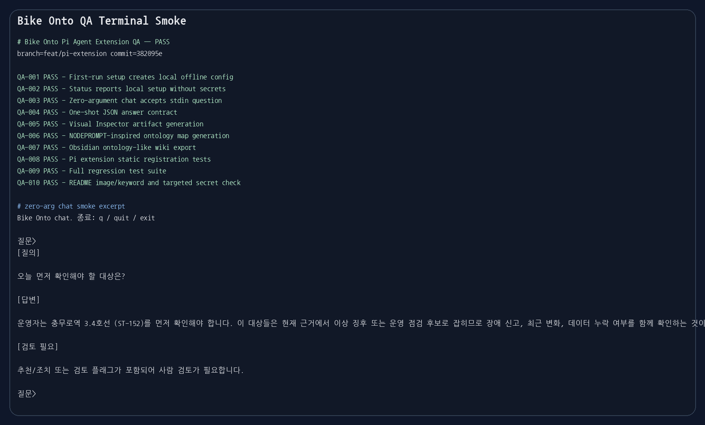
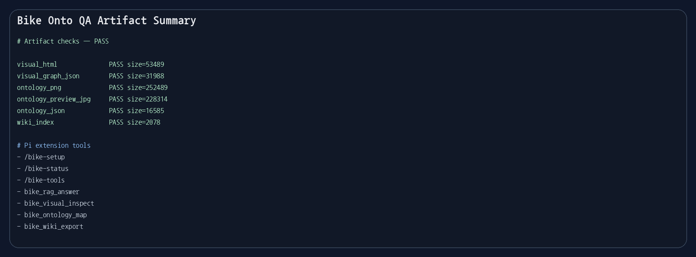

# Bike Onto Pi Agent Extension QA 보고서

# Timestamp: 2026-05-19 15:25:00

## 요약

- 전체 결과: **PASS**
- 브랜치: `feat/pi-extension`
- 테스트 대상 커밋: `382095e`
- 격리된 setup 위치: `/tmp/bike_onto_pi_agent_extension_qa_home`
- 산출물 위치: `docs/qa/2026-05-19/pi_agent_extension_qa`
- 통과: `10` / 실패: `0`
- 전체 회귀 테스트: `187 passed, 3 warnings`

## 스크린샷

## 테스트 결과

| ID | Status | 시나리오 | 증거 로그 |
|---|---|---|---|
| QA-001 | PASS | 첫 setup이 local offline config를 만든다 | `docs/qa/2026-05-19/pi_agent_extension_qa/logs/01_setup.json` |
| QA-002 | PASS | status가 secret 없이 local setup 상태를 보여준다 | `docs/qa/2026-05-19/pi_agent_extension_qa/logs/02_status.json` |
| QA-003 | PASS | 인자 없는 chat이 stdin 질문을 받는다 | `docs/qa/2026-05-19/pi_agent_extension_qa/logs/03_zero_arg_chat.txt` |
| QA-004 | PASS | one-shot JSON 답변 계약을 확인한다 | `docs/qa/2026-05-19/pi_agent_extension_qa/logs/04_ask_answer.json` |
| QA-005 | PASS | Visual Inspector artifact를 생성한다 | `docs/qa/2026-05-19/pi_agent_extension_qa/logs/05_visual.json` |
| QA-006 | PASS | NODEPROMPT-inspired ontology map을 생성한다 | `docs/qa/2026-05-19/pi_agent_extension_qa/logs/06_ontology_map.json` |
| QA-007 | PASS | Obsidian ontology-like wiki를 내보낸다 | `docs/qa/2026-05-19/pi_agent_extension_qa/logs/07_wiki_export.json` |
| QA-008 | PASS | Pi extension command/tool 등록을 확인한다 | `docs/qa/2026-05-19/pi_agent_extension_qa/logs/08_pytest_pi_extension.txt` |
| QA-009 | PASS | 전체 회귀 테스트를 실행한다 | `docs/qa/2026-05-19/pi_agent_extension_qa/logs/09_pytest_full.txt` |
| QA-010 | PASS | README 이미지, 금지 키워드, 주요 secret 패턴을 확인한다 | `docs/qa/2026-05-19/pi_agent_extension_qa/logs/10_readme_secret_check.json` |

## Artifact 증거

| Artifact | 존재 여부 | 크기(bytes) |
|---|---:|---:|
| visual_html | `True` | `53489` |
| visual_graph_json | `True` | `31988` |
| ontology_png | `True` | `252489` |
| ontology_preview_jpg | `True` | `228314` |
| ontology_json | `True` | `16585` |
| wiki_index | `True` | `2078` |

## Pi Agent Extension 검증 범위

- Project-local extension path: `.pi/extensions/bike-onto/index.ts`
- 확인한 commands: `/bike-setup`, `/bike-status`, `/bike-tools`
- 확인한 tools: `bike_rag_answer`, `bike_visual_inspect`, `bike_ontology_map`, `bike_wiki_export`
- Adapter model 확인: Pi tool call이 안정적인 `./bike` CLI core를 감싸서 호출한다.

## README / Secret 확인

- 누락된 README 이미지: `[]`
- README 금지 키워드: `{}`
- 주요 secret 패턴 탐지: `{}`
- Pi extension 문서화 여부: `True`
- Adapter 설명 문서화 여부: `True`

## 비고

- QA는 offline mode와 임시 `BIKE_ONTO_HOME`을 사용했습니다. 외부 API나 production DB는 필요하지 않았습니다.
- pgvector live retrieval과 실제 Pi interactive LLM turn은 optional/manual check로 남겨두었습니다.
- Pi extension은 full MCP server가 아니라, CLI-first inspection core 위에 붙는 project-local adapter로 검증했습니다.
